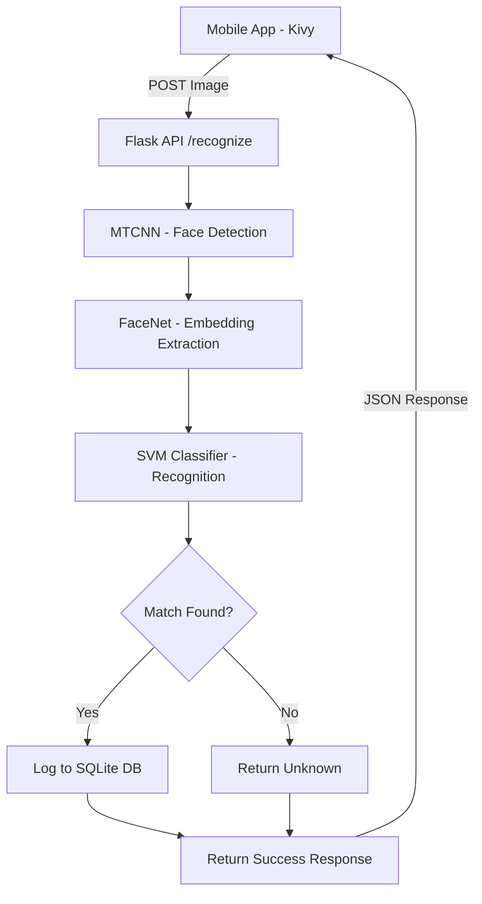

# Facial Recognition Attendance System

An automated, contactless attendance marking system leveraging deep learning (FaceNet) and mobile technology. This project uses a Flask backend for facial recognition and a Kivy-based mobile application for image capture.

## 🚀 Overview

The **Facial Recognition Attendance System** replaces traditional manual attendance with an AI-driven solution. It detects and recognizes faces using a pre-trained MTCNN and InceptionResnetV1 (FaceNet), classifies them using an SVM model, and logs attendance into a SQLite database with real-time feedback.

## 🛠️ Technology Stack

-   **Backend:** Python 3.8+, Flask
-   **Mobile App:** Kivy, KivyMD (Cross-platform)
-   **Deep Learning:** 
    -   `facenet-pytorch` (InceptionResnetV1)
    -   `MTCNN` (Face detection)
    -   `SVM` (Support Vector Machine) for classification
-   **Computer Vision:** OpenCV (cv2)
-   **Database:** SQLite3
-   **Others:** NumPy, PIL, Joblib

## 🏗️ System Architecture



## 📁 Project Structure

```text
FacialRecognitionAttendance/
│
├── app/                      → Mobile app UI and logic
├── dataset/                  → Registered user face images
├── models/                   → Trained SVM model and Label Encoder
├── scripts/                  → Utility scripts (Database init, etc.)
├── app.py                    → Main Flask Backend API
├── main.py                   → Mobile Application Entry Point
├── attendance.db             → SQLite database for logs
├── requirements.txt          → Project dependencies
└── README.md                 → Project documentation
```

## ⚙️ Setup & Installation

### 1. Prerequistes
Ensure you have Python 3.8+ installed.

### 2. Install Dependencies
```bash
pip install -r requirements.txt
```

### 3. Initialize Database
```bash
python init_db.py
```

### 4. Run the Backend Server
```bash
python app.py
```
*The server will run on `http://0.0.0.0:5000`.*

### 5. Run the Mobile App
*Note: Ensure your PC and mobile device are on the same network. Update the server IP in `main.py` before running.*
```bash
python main.py
```

## ✨ Key Features

-   **High Accuracy:** Leverages FaceNet (InceptionResnetV1) for robust face embeddings.
-   **Contactless:** Entirely image-based attendance marking.
-   **Real-time Processing:** Attendance logged within seconds of image capture.
-   **Duplicate Prevention:** Prevents marking attendance multiple times for the same person on the same day.

## 👥 Contributors

-   **Muhammad Huzaifa**
-   **Usbah Saleem**

---
*Developed for Machine Learning Lab Project.*
